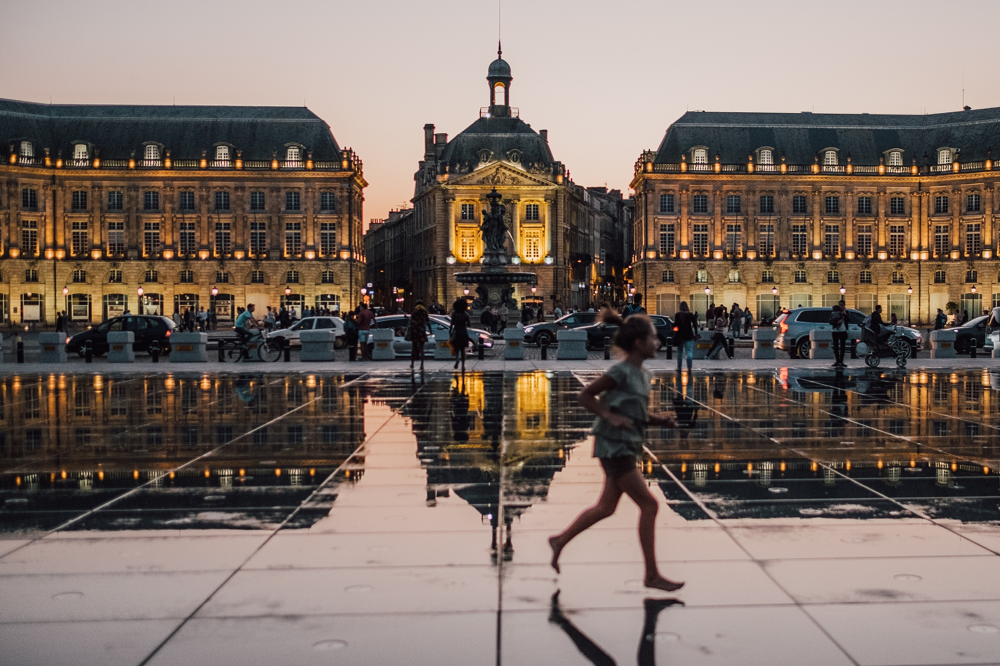

# Le coeur en intraveineuse

## Contenu

Seule dans le box numéro 6 des urgences de l'hôpital de Saint-André dans un pays qui n'est pas le mien, je regarde défiler douleur, peur, regret, tristesse et presque deux ans de ma vie.

Le docteur entre sans frapper avec son interne et un air important. Il écoute avec attention le diagnostic de son ailière, puis il s'adresse à moi:  
– Nous avons exclu la pyélonéphrite, la fonction rénale est normale. Nous suspectons une colique néphrétique. Vous pouvez sortir sous réserve d'un scanner dans les 48 heures.

Alors qu'ils disparaissent, je regarde défiler un flot d'images qui éclaircit pour moi mon état. Non Docteur, ce n'est pas une colique néphrétique.

C'est la finalisation de deux ans, 20 weekend, autant de vendredis soir, de samedis et de dimanches. Plus de 400 heures de cours, près de 40'000KM parcourus, de multiples traversées de mon pays. Des vols depuis Londres, Bâle, Zurich, Barcelone, Bordeaux ou Genève. Des trains depuis Villeneuve, Lausanne, Territet, Zurich ou Genève.  
Une cinquantaine de nuits hors de chez moi à un moment où j'aurais donné un royaume pour mon lit.

C'est Bordeaux et ses vieux bâtiments majestueux que l'on ne pense plus à regarder de haut en bas et qui, pour beaucoup, puent la pisse du soir au matin. C'est la saleté et les crottes de chien sur les trottoirs.

C'est les grêves aériennes, les avions du vendredi matin enneigés, ceux du dimanche soir retardés, déviés ou annulés. C'est un TGV attrapé à la der avec changement de train et de gare à Paris. L'angoisse.

C'est mon père qui m'écrit ce weekend des mots que je ne lui connais pas. Et ma mère qui fait de même oralement le même jour. Quelle synchronicité parfaite pour des êtres qui ne se parlent pas.

C'est les pizzas, les glaces, les sushis, les pâtes maison, les poke bowls, les salades, les burgers, les crêpes, les croissants, les pains au chocolats, les bibimbaps, les canelés baillardrans, les fruits secs, les gâteaux, les yaourts, les crackers, les brunch, les dizaines de litres de thé chaud et froid , le café, les fruits, les lattes qu'on a engouffrés dans les meilleurs et parfois les pires endroits de la ville.

C'est le *avant* versus le *après*: de sans domicile fixe pas très sûre de la pérennité objective de son plan squattant sur le canapé chez sa mère à un lieu de vie fixe et la constatation que oui le plan est stable: je peux écrire chaque jour si cela me chante.

C'est tous les Airbnb dans lesquels j'ai dormi. Toutes nuits où je me suis sentie chez moi, et toutes celles où j'avais le mal du pays, d'une maison, de Lui.

C'est Monsieur Laurent dont la façon de repasser les draps et de faire les lits s'approche des voûtes célestes et m'ont rapprochée d'un chez moi.

C'est mon premier livre publié. C'est celui d'Amandiane, qui week-end après weekend dit qu'elle n'a rien fait.  
C'est la relativité du *rien*, ces impressions de *rien* qui nous collent à la peau et nous mettent les compteurs à l'envers.

C'est une propension nouvelle à regarder au-delà de l'oeuvre et de l'artiste pour voir l'humain, la fragilité, la démarche : McSolaar, Eric, Steinbeck, Agnès, Christine and the Queen, Jules, R. Bradbury, Lily B. Francis, F. Verdier, Anaël, Brigitte, Sylvie, Michelange et tous les autres.

C'est tous ces gens à Bordeaux qui vivent dans la rue, en groupe, en couple, seuls/es, avec leurs chiens, dans un état de santé qui me semble parfois précaire.  
C'est moi qui ne crois pas à la distribution de poisson mais à l'enseignement de la pêche. Sauf que pendant ces vingt mois je n'ai ni donné de poisson ni enseigné à personne à pêcher.

Ce sont ces chiens qui semblent tour à tour craindre et adorer leur maître.

C'est toutes ces minutes, heures, jours, mois de doute. Que veut ce personnage? Et ce texte? En serai-je capable.

C'est Face nord et ses dragons dorés, son chat Virgile aux grands yeux, son chevalier noir, son sous-sol humide qui sous couvert d'être une consigne à bagage est une salle de torture, ses histoires d'amour qui n'en sont pas, son guide pratique déjànté que j'ai hâte de lire, l'union d'une fratrie, dans un roman et en vrai.  
C'est ses 72 kilomètres de course dans la nuit, en hiver et en montagne. En plus du reste, juste parce que.  
¨C'est le mental, juste une question de décider¨, elle me dit.  
C'est notre zoo fou, mon croco qui bouffe une petite fille – euh non le contraire.Notre oiseau qui ne veut pas arrêter d'apprendre à voler.

Ce sont les Rues de Bordeaux qui ont passé d'un labyrinthe intriqué menaçant de m'engloutir à un centre ville agréable et facile à naviguer.

C'est un *coach* d'écriture qui a passé de barbu, intimidant et sévère à exigeant dans plus de douceur et toujours aussi barbu.

C'est la gratitude d'avoir pu accéder à mes rêves, de m'être fait dérouler un pont sur mesure sous les pieds.

C'est des rêves d'eau, d'océan et des cauchemars de bureau.

Ce sont mes listes ¨à faire¨ qui se sont fait la malle sans préavis.

C'est [un massage corps coeur âme](http://virginieg.com/2018/04/08/un-reve-en-italien/) que je ne suis pas près d'oublier.

C'est six mois de physio pour avoir toujours mal à l'épaule.

Ce sont les heures passées devant un écran, sans témoins, sans feux d'artifice, sans fanfare, et avec si peu de résultats entre les mains. Parce que les voies de ce nouveau paradigme sont tout sauf linéraires.

C'est l'apprentissage de la patience et de l'immobilisme, du laisser faire. À moi!

C'est une centaine de milliers de mots posés, analysés, déplacés, tracés, réécris, remplacés. Et ma difficulté à écrire deux cartes en ce dernier jour.

C'est mon inconscient qui m'invite dans les méandres de ce qu'elle veut que j'écrive. Si elle le veut. Quand elle le veut. C'est arrêter de me battre ou d'essayer de comprendre: elle aura toujours le dernier mot, c'est établi.

C'est l'accueil des cubes violets, des sosies, des clones, des histoires que j'écris et ne comprends pas, des séances d'écriture sans queue ni tête. Ce sont les larmes de confusion, de frustration, de désespoir et de rage ravalées. Et celles de gratitude. Parce que tant qu'elle me parle, c'est que je suis vivante.

Ce sont tous ces billets de blog qui s'invitent chez moi alors que j'aimerais être en train d'écrire autre chose, mon roman par exemple. Et c'est mon roman qui me boude.

C'est une soirée Très Happy Hour, des cocktails colorés trop sucrés ou trop alcoolisés, qu'importe. Les gonds de la bienséance qui sautent, un regard léger posé sur nos plaies, un beau moment.

C'est Amandine qui me demande le lien entre le titre de mon roman et l'anecdote que je leur partage à table.

Ce sont les fous-rires édition 2018. C'est son rire qui résonne, à Bordeaux et je l'espère à Lyon.

C'est la gentillesse de certaines âmes croisées, la neutralité de certaines autres et l'amertume crasse des dernières.

C'est Lui, d'un support indéfectible. Ce sont ses visites, ses encouragements sans mots, ses glaces, son plaisir à me voir les talons. C'est sa foi sans données, sans preuves, sans raison, lui qui ne croit qu'en ce qui est tangible est éprouvé.

C'est la découverte que oui il y a des choses que je ferais avec plaisir jusque à ma mort, que je ne suis pas forcément si bizarre, peut-être jusqu'ici mal orientée.

C'est une victoire. Sur moi-même, sur le monde du travail, sur ma croyance de devoir y vivre et surtout y mourir. Un pied de nez à la norme, au *safe,*aux jugement sceptiques de ce dont on n'a pas l'habitude.

C'est tous ces musées, monuments et boutiques que je n'aurai pas vus à Bordeaux, tous ces vins que je n'aurai pas goûté.

C'est moi qui [suis un auteur](https://virginieg.com/2017/06/12/derriere-les-mots/); c'est moi qui ai [rendu ma plus belle pièce de joaillerie](http://virginieg.com/2018/05/24/le-retour/). Enfin. Peut-être.

C'est l'*escape room*avec sept auteurs au top. C'est la prison confinée, surchauffée, sombre avec quelqu'un que je ne connais pas, charmante au demeurant. C'est l'écran qui crachait des indices à la pelle et nous qui avons failli y rester.

C'est Brigitte qui me fait signe d'aller piquer des talkies walkies avec elle, comme deux gamines en mal d'action. Quand on est à Bordeaux avec Brigitte tout est permis. Y compris le délit de fuite.

C'est des adieux sous néons et sous perfusion. Mais moi je le sais, ce n'est qu'un au revoir.

C'est Monsieur Laurent qui, venant de m'expliquer qu'il a un ¨coeur de pierre¨, m'attend à l'accueil des urgences à ma sortie, 5 heures plus tard.

Merci Bordeaux, merci [Anaël](https://ecrire.tv/about/), merci Monsieur Laurent, merci Le Cercle des Auteurs Apparus.

\*\*\*

Pour rejoindre mon [Club de lecteurs](http://virginieg.com/clubdelecteurs).

\*\*\*

*Crédit d'image: [Guillaume Flandre, Unsplash](https://unsplash.com/@gflandre?utm_medium=referral&utm_campaign=photographer-credit&utm_content=creditBadge)*
