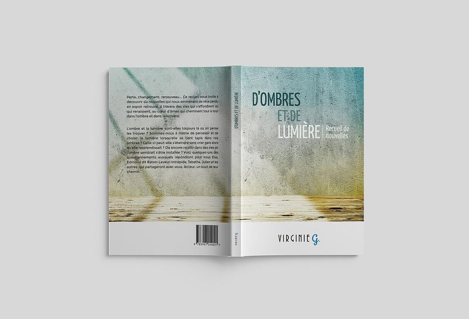
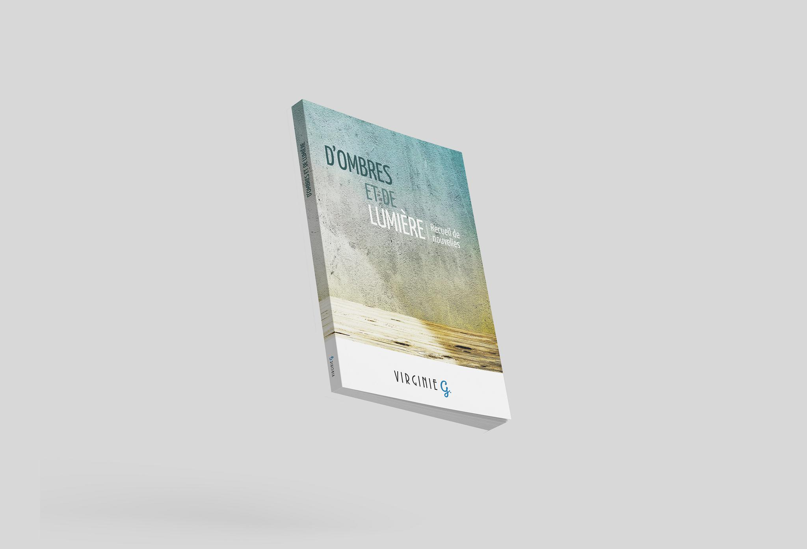
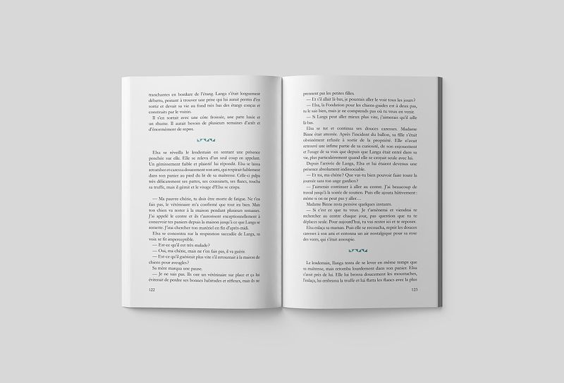
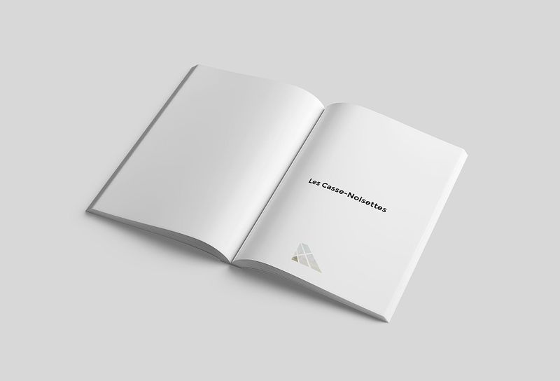

# D'ombres et de Lumière
*Recueil de nouvelles*

## Informations

| | |
|---|---|
| Prix (broché) | €19.00 |
| Pages | 144 |
| Format | 12.7x20.3 cm |
| Langue | Française |
| ISBN | 978-3-907240-02-1 |
| Édition | 2e édition de octobre 2019 (1re édition: septembre 2017) |

## Résumé

Perte, changement, renouveau… Ce recueil nous invite à découvrir six nouvelles qui nous emmènent de rêve perdu en espoir retrouvé, à travers des vies qui s’effondrent ou qui renaissent, au cœur d’âmes qui cheminent tour à tour dans l’ombre et dans la lumière.

L’ombre et la lumière sont-elles toujours là où on pense les trouver ? Sommes-nous à même de percevoir et de choisir la lumière lorsqu’elle se tient tapie dans nos ombres ? Celle-ci peut-elle s'éteindre sans crier gare alors qu'elle resplendissait ? Ou encore rejaillir dans des vies où l’ombre semblait s’être installée ? Voici quelques-uns des questionnements auxquels répondront pour nous Elsa, Edmond dit Raton Laveur Intrépide, Tabatha, Julien et les autres, qui partageront avec vous, lecteur, un bout de leur chemin.

© Virginie G. - 2021

## Disponibilité

Également disponible en version électronique pour Kindle, Nook, Kobo, Google Play et Apple Books dans la boutique (catégorie: Livres électroniques)

## Liens

- [Acheter la version papier](https://virginieg.com/product/dombres-et-de-lumiere)
- [Version ebook (Amazon Kindle)](https://www.amazon.co.uk/kindle-dbs/entity/author/B071WC8RCX)
