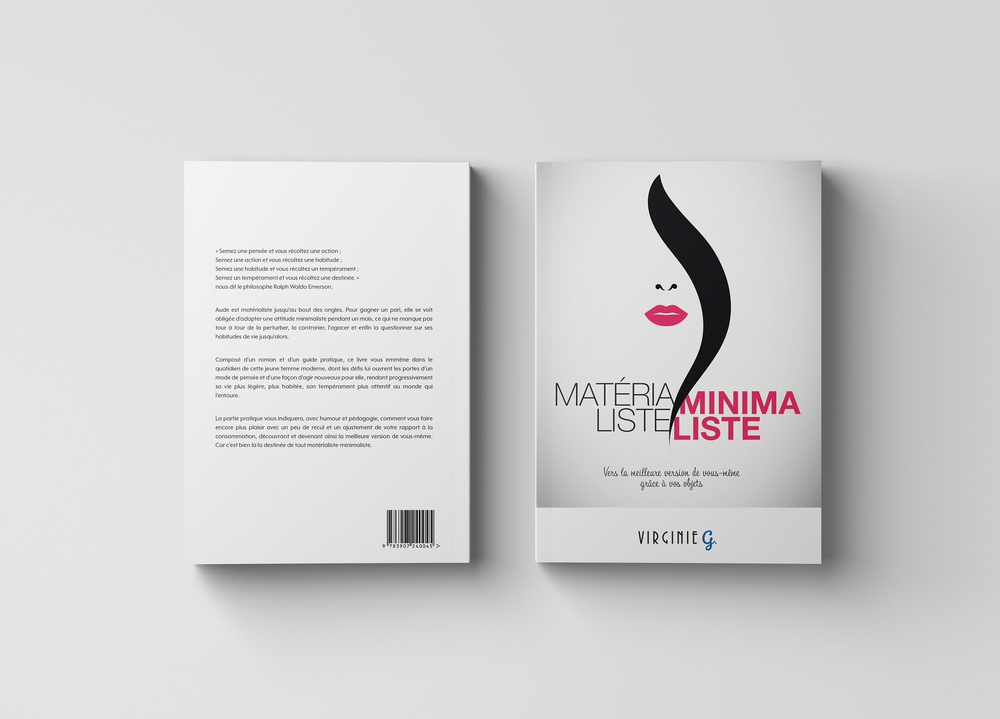
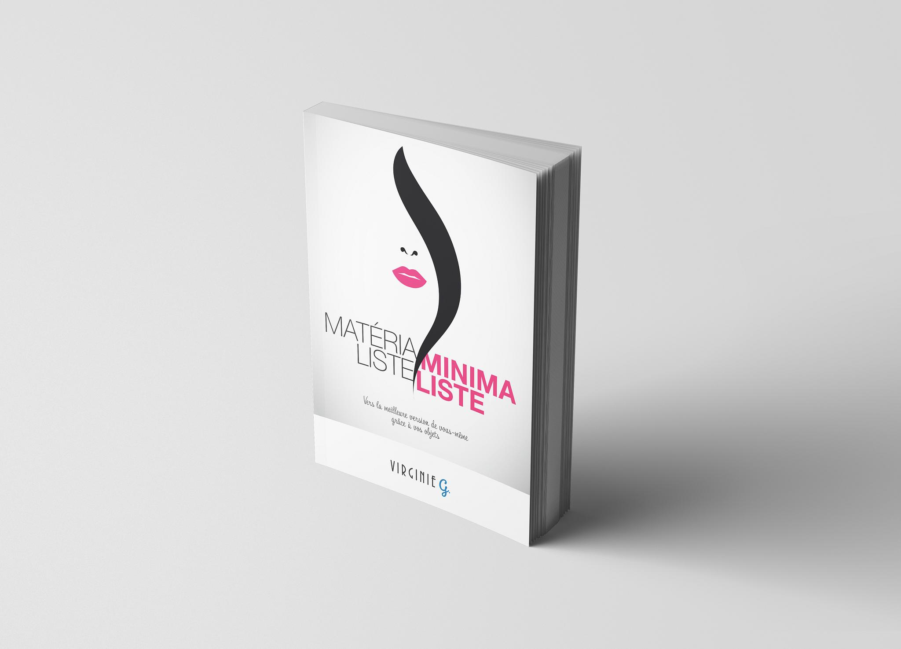
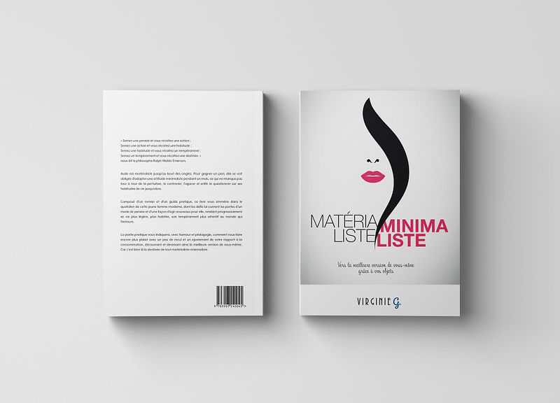
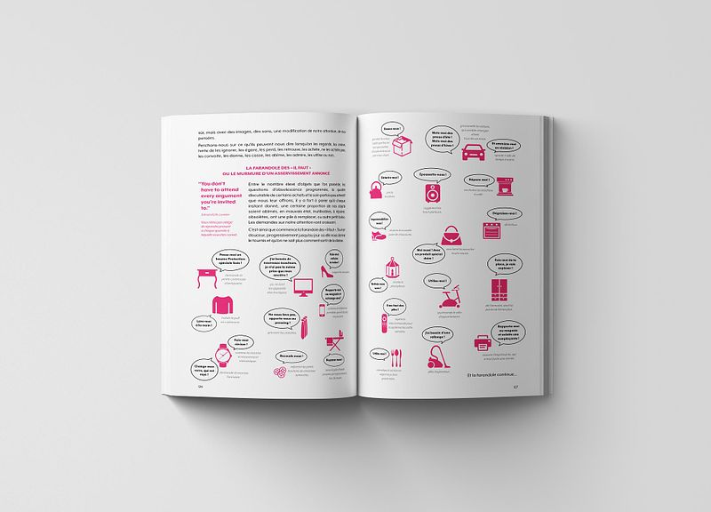
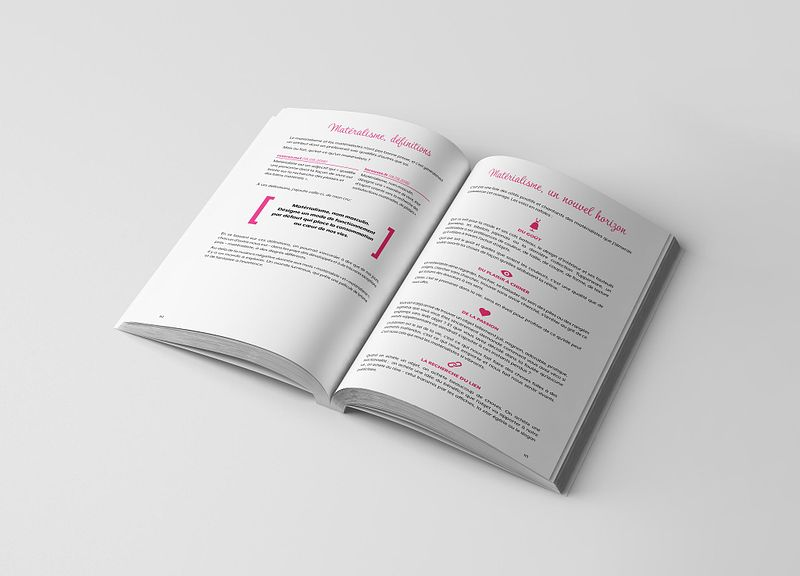

# Matérialiste-minimaliste
*Vers la meilleure version de vous-même grâce à vos objets*

## Informations

| | |
|---|---|
| Prix (broché) | €25.00 |
| Pages | 212 |
| Format | 15.2x22.9 cm |
| Langue | Française |
| ISBN | 978-3-907240-04-5 |
| Édition | 2e édition de novembre 2019 (1re édition: novembre 2018) |

## Résumé

« Semez une pensée et vous récoltez une action ;Semez une action et vous récoltez une habitude ;Semez une habitude et vous récoltez un tempérament ;Semez un tempérament et vous récoltez une destinée. », nous dit le philosophe Ralph Waldo Emerson.

Aude est matérialiste jusqu’au bout des ongles. Pour gagner un pari, elle se voit obligée d’adopter une attitude minimaliste pendant un mois, ce qui ne manque pas tour à tour de la perturber, la contrarier, l'agacer et enfin la questionner sur ses habitudes de vie jusqu'alors.

Composé d’un roman et d’un guide pratique, ce livre vous emmène dans le quotidien de cette jeune femme moderne, dont les défis lui ouvrent les portes d’un mode de pensée et d’une façon d’agir nouveaux pour elle, rendant progressivement sa vie plus légère, plus habitée, son tempérament plus attentif au monde qui l’entoure.

La partie pratique vous indiquera, avec humour et pédagogie, comment vous faire encore plus plaisir avec un peu de recul et un ajustement de votre rapport à la consommation, découvrant et devenant ainsi la meilleure version de vous-même. Car c’est bien là la destinée de tout matérialiste-minimaliste.

© Virginie G. - 2021

## Disponibilité

Également disponible en version électronique pour Kindle, Nook, Kobo, Google Play et Apple Books dans la boutique (catégorie: Livres électroniques)

## Liens

- [Acheter la version papier](mailto:virginie@virginieg.com)
- [Version ebook (Amazon Kindle)](https://www.amazon.co.uk/kindle-dbs/entity/author/B071WC8RCX)
