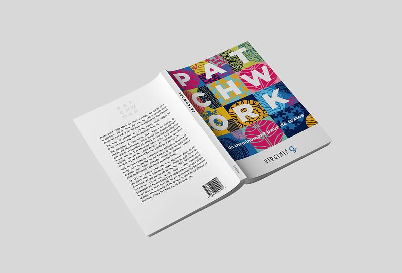
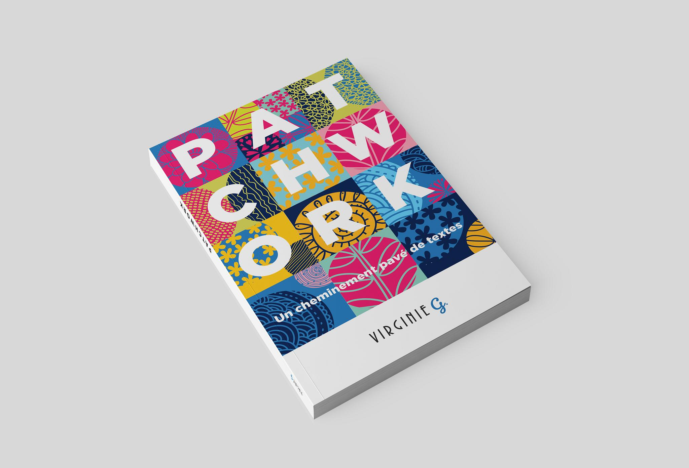
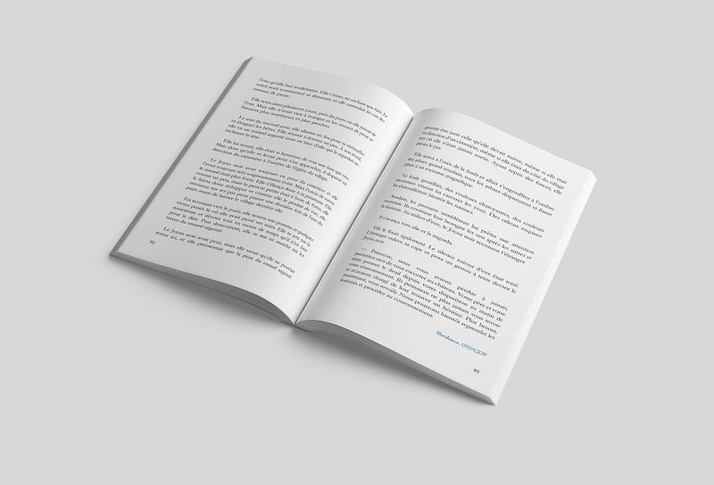

# Patchwork
*Un cheminement pavé de textes*

## Informations

| | |
|---|---|
| Prix (broché) | €19.00 |
| Pages | 112 |
| Format | 12.7x20.3 cm |
| Langue | Française |
| ISBN | 978-3-907240-00-7 |
| Édition | 2e édition de mai 2019 (1re édition: décembre 2017) |

## Résumé

Avez-vous déjà rêvé de tout changer, de quitter votre quotidien, votre lieu de vie ou votre emploi pour commencer autre chose ou pour réaliser un rêve ? Moi oui.J'ai pris la plume en 2016, après avoir largué les amarres sans trop savoir où était le nord.J'ai navigué à vue dans des océans de doutes, de sueur, de résistance. J’ai abordé des rivages cléments qui m’ont accueillie et offert révélations et allégresse avant de se transformer sans crier gare en déserts arides. La seule constante : un combat quotidien soutenu par des petits pas posés jour après jour.Patchwork retrace à travers une sélection de billets de blog, de nouvelles et de textes courts les différentes étapes de mon périple entre la décision d’écrire et la publication de mon premier livre.Je les ai réunis afin de me rappeler, ainsi qu'aux lecteurs qui aimeraient lever l'ancre, qu’à force de patience et de persévérance, les états intérieurs sont reconnus pour ce qu’ils sont : des intempéries passagères faisant partie intégrante de la route. Et que quel que soit l’objectif, le progrès montre timidement le bout de son nez et toujours, quand on s'y efforce, on avance. Dans les textes, et dans la vie.

© Virginie G. - 2021

## Disponibilité

Également disponible en version électronique pour Kindle, Nook, Kobo, Google Play et Apple Books dans la boutique (catégorie: Livres électroniques)

## Liens

- [Acheter la version papier](https://virginieg.com/product/patchwork)
- [Version ebook (Amazon Kindle)](https://www.amazon.co.uk/kindle-dbs/entity/author/B071WC8RCX)
