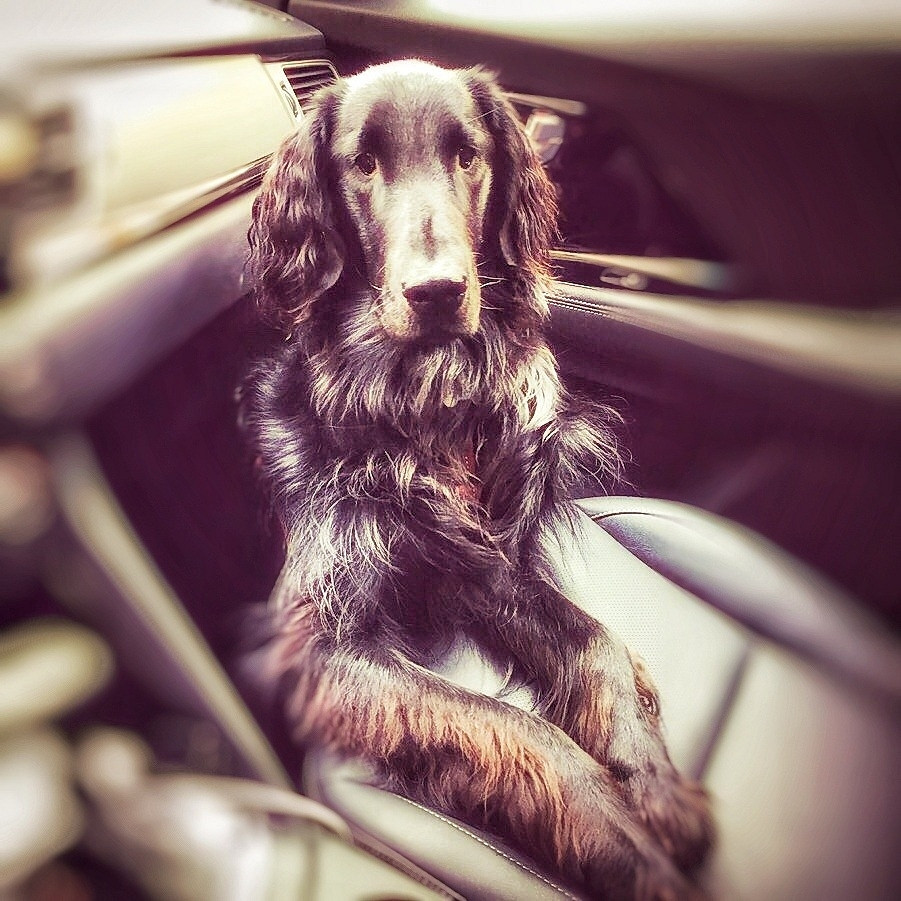
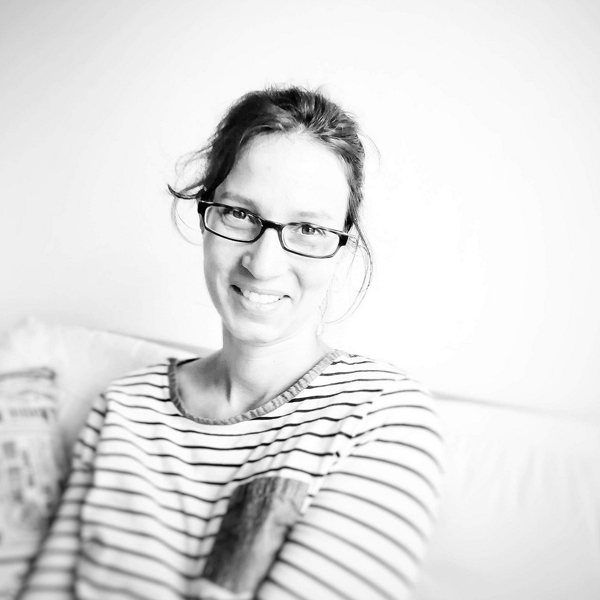
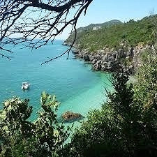

# Bienvenue

Bienvenue chez moi.

Je m'appelle Virginie et je suis auteure indépendante. Cela signifie que j'écris mes livres, puis travaille personnellement avec une correctrice, une graphiste et un imprimeur pour les mettre en forme, aux standards et en beauté. Je les publie donc sans le sceau d'une maison d'édition, mais avec une qualité égale. Je les vends sur ma [boutique en ligne](livres/) en édition papier, et sur Amazon (KDP select) pour les versions électroniques.

N'hésitez pas à offrir un de mes livres à un proche ou à vous-même. Pour savoir de quoi ils parlent et ce qu'en disent les lecteurs, voyez les sections y relatives sur votre gauche.

Vous pouvez aussi me découvrir à travers mes billets de blog, publiés sur ce site.

Si vous voulez plus d'informations et des nouvelles, rejoignez mon [cercle de lecteurs](https://virginieg.com/cercledelecteurs) , ou suivez-moi sur [Insta](https://www.instagram.com/virginieg.auteure/) ou [Facebook](https://www.facebook.com/virginieg.auteure1/) . Ou écrivez-moi sous ¨contact¨ :)

Bonne lecture,

Virginie
